# Patient Vital Monitoring Pipeline using Google Cloud Platform (GCP)

## Overview

This project implements a **real-time healthcare data pipeline** using Google Cloud Platform. It simulates patient vital signs, streams them through a distributed messaging system, processes them in real-time, stores them in a data warehouse, and visualizes insights through dashboards.

This is not just an implementation — it is a **full data engineering workflow**, demonstrating how modern streaming systems are designed, built, and operated in production environments.

---

# Core Objective

The goal of this project is to:

- Build a **scalable streaming data pipeline**
- Apply **Medallion Architecture (Bronze → Silver → Gold)**
- Understand **event-driven systems**
- Learn **cloud-native data engineering patterns**

---

# System Architecture

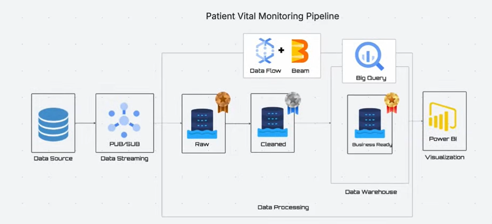

---

# End-to-End Flow

```text
Data Simulator → Pub/Sub → Dataflow (Apache Beam) → BigQuery → Dashboard
```

---

# Step-by-Step Breakdown (What, Why, Importance)

---

# 1. Enabling GCP Services

## What is Created?

You enable APIs:
- Dataflow API
- Pub/Sub API
- BigQuery API
- Cloud Storage API

## Why This is Done

GCP services are not active by default. Enabling APIs allows your project to:
- Provision resources
- Execute jobs
- Communicate between services

## Why It’s Important

Without enabling services:
- Dataflow jobs won’t run
- Pub/Sub won’t accept messages
- BigQuery won’t store data

This is the **foundation layer** of your infrastructure.

---

# 2. Cloud Storage Bucket

## What is Created?

A **GCS bucket**, for example:

```bash
gs://patient-vital-streaming-bucket1
```

With:
- `/staging` folder
- `/temp` folder

---

## Cloud Storage

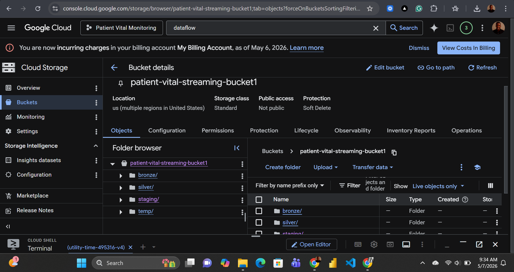

---

## Why This is Created

Dataflow requires storage for:
- Staging pipeline code
- Temporary processing files
- Shuffle operations

---

## Why It’s Important

Think of Cloud Storage as:
> The **working memory** of your pipeline

Without it:
- Dataflow jobs will fail at runtime
- Intermediate data cannot be processed

---

# 3. Pub/Sub Topic

## What is Created?

A **Pub/Sub Topic**:

```bash
patient_vitals_topic
```

---

## Topic Created

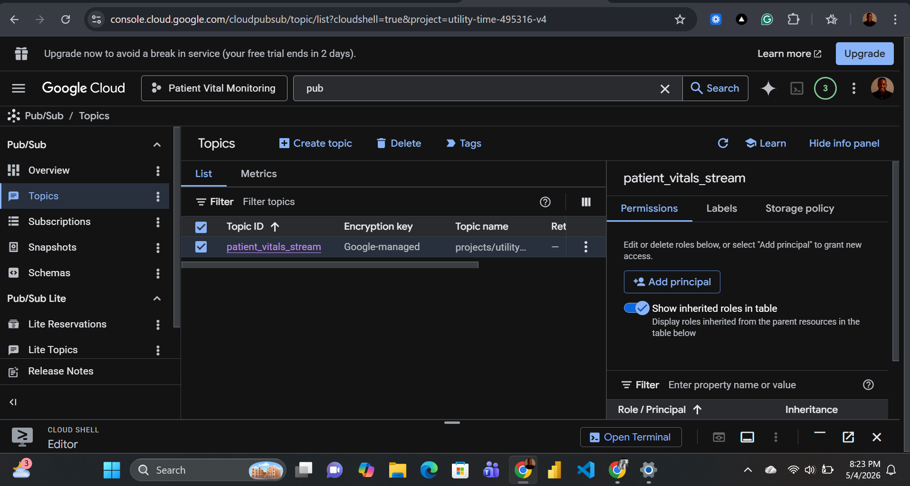

---

## Why This is Created

A topic is a **message ingestion endpoint**.

It receives streaming data from producers (your simulator).

---

## Why It’s Important

Pub/Sub enables:
- **Decoupling** (producers and consumers don’t depend on each other)
- **Scalability** (millions of events per second)
- **Reliability** (message durability)

This is the **entry point of your data pipeline**.

---

# 4. Pub/Sub Subscription

## What is Created?

A **subscription**:

```bash
patient_vitals_subscription
```

---

## Subscription Created

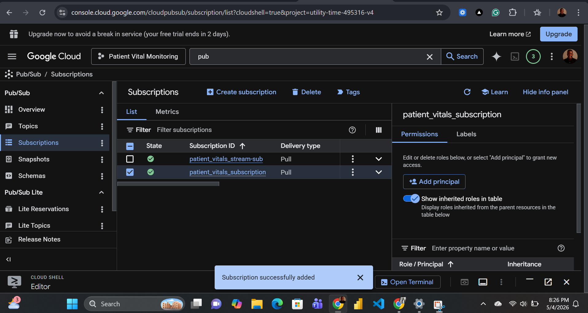

---

## Why This is Created

A subscription allows a service (Dataflow) to:
- **Read messages from a topic**

---

## Why It’s Important

Without a subscription:
- Messages exist but cannot be consumed

Think of it as:
> A **data stream tap** connected to your topic

---

# 5. Data Simulator

## What is Created?

A Python script that generates:

- Heart rate
- Oxygen level
- Temperature
- Timestamp
- Patient ID

---

## Simulated Data

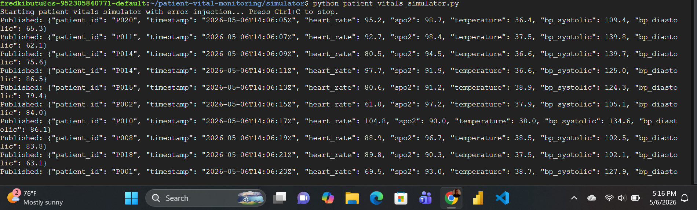

---

## Why This is Created

Real-world systems rely on:
- IoT devices
- Medical sensors

Since you don’t have real devices, you simulate data.

---

## Why It’s Important

This allows you to:
- Test real-time pipelines
- Mimic production systems
- Validate streaming behavior

---

# 6. Apache Beam Pipeline

## What is Created?

A streaming pipeline using:

- `ReadFromPubSub`
- Transformations
- Cleaning logic
- BigQuery sink

---

## Why This is Created

Apache Beam defines:
- **Data processing logic**
- Independent of execution engine

---

## Why It’s Important

Beam provides:
- Portability (can run on multiple runners)
- Abstraction over distributed processing
- Unified batch + streaming model

This is the **core logic layer** of your system.

---

# 7. Data Cleaning Layer

## What is Created?

A transformation stage that:
- Removes invalid records
- Handles missing values
- Standardizes formats

---

## Data Cleaning

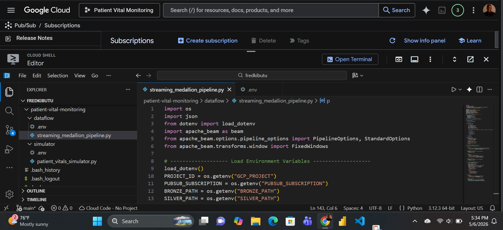

---

## Why This is Created

Raw streaming data is:
- Noisy
- Inconsistent
- Sometimes corrupt

---

## Why It’s Important

Garbage in → Garbage out.

Cleaning ensures:
- Accurate analytics
- Reliable dashboards
- Trustworthy insights

---

# 8. Dataflow Job

## What is Created?

A **managed streaming job** on GCP Dataflow.

---

## Dataflow Job

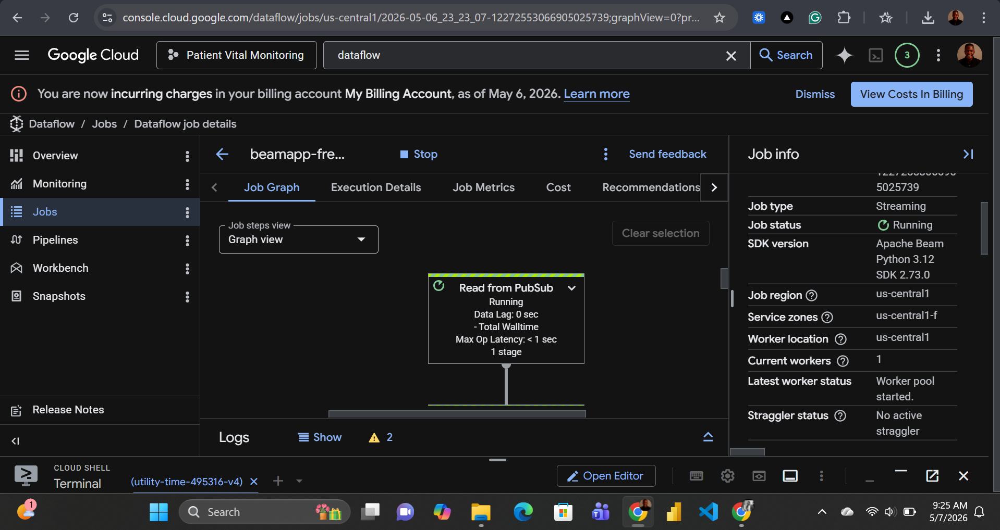

---

## Dataflow Running

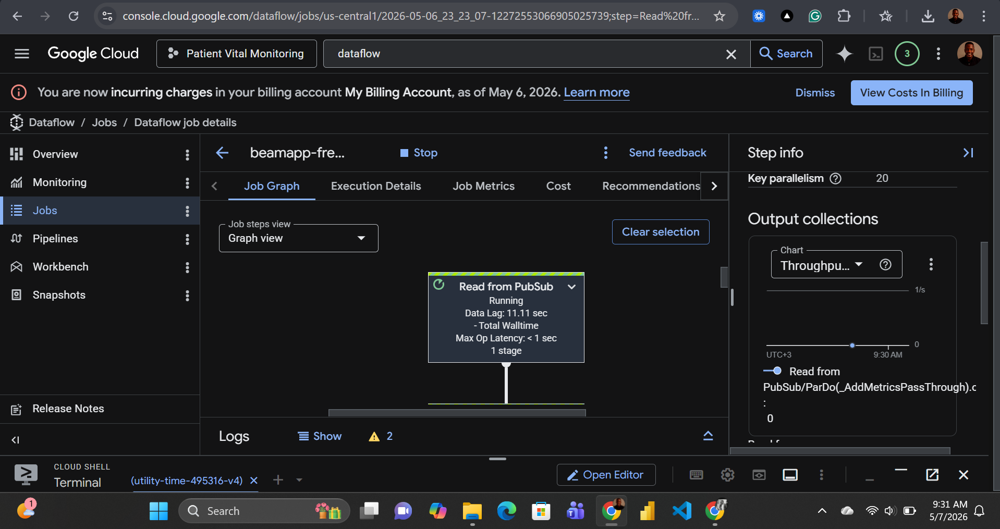

---

## Why This is Created

Dataflow executes your Beam pipeline:
- Distributes computation
- Handles scaling automatically
- Manages fault tolerance

---

## Why It’s Important

This is where:
> Your pipeline becomes **production-grade**

You get:
- Auto-scaling
- Parallel processing
- High availability

---

# 9. BigQuery Tables

## What is Created?

Three logical layers:

- **Bronze Table** → Raw data  
- **Silver Table** → Cleaned data  
- **Gold Table** → Aggregated insights  

---

## BigQuery Tables

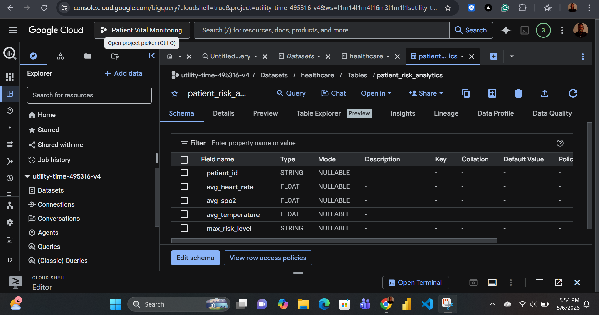

---

## BigQuery Data

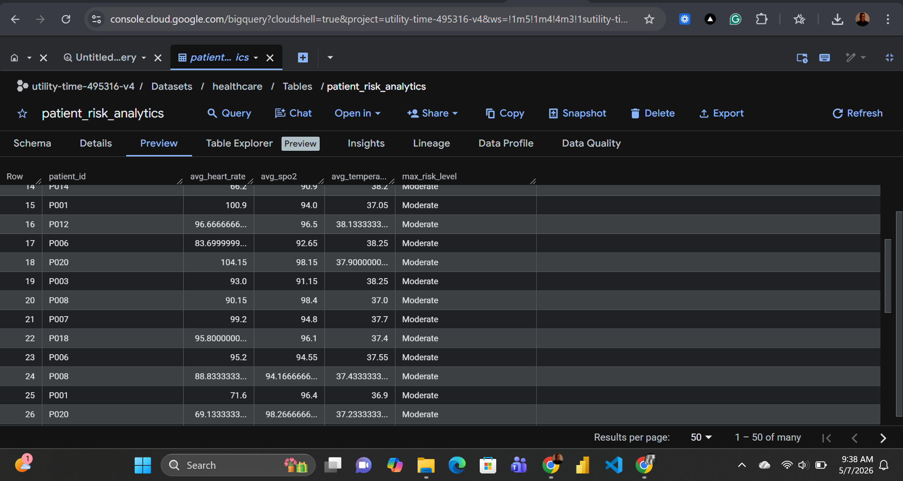

---

## Why This is Created

BigQuery acts as:
- A **data warehouse**
- A **query engine**

---

## Why It’s Important

It enables:
- SQL analytics
- Fast queries on large datasets
- Integration with dashboards

This is your **analytics layer**.

---

# 10. Dashboard

## What is Created?

A visualization layer showing:
- Patient trends
- Average vitals
- Anomalies

---

## Dashboard

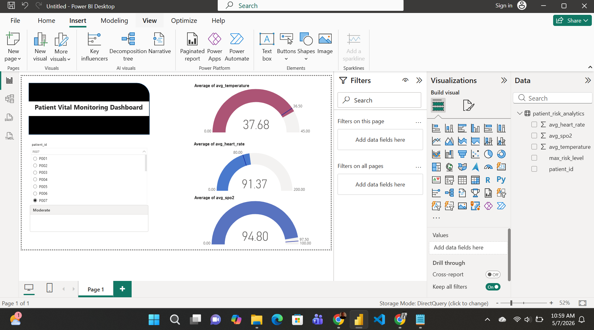

---

## Why This is Created

Raw data is not useful to stakeholders.

Dashboards:
- Translate data into insights
- Enable decision-making

---

## Why It’s Important

This is where:
> Data becomes **actionable intelligence**

---

# Medallion Architecture (Deep Explanation)

## Bronze Layer

- Raw ingestion
- No transformation

**Why:**
- Data lineage
- Replay capability

---

## Silver Layer

- Cleaned + validated

**Why:**
- Reliable datasets
- Standardization

---

## Gold Layer

- Aggregated + business-ready

**Why:**
- Reporting
- Decision-making

---

# IAM Permissions (Critical Concept)

## What is Configured?

Roles assigned:

- `roles/dataflow.worker`
- `roles/pubsub.subscriber`
- `roles/storage.objectAdmin`

---

## Why This is Done

GCP uses **Identity and Access Management (IAM)**.

Services cannot act unless:
- Permissions are explicitly granted

---

## Why It’s Important

Without IAM:
- Dataflow cannot read Pub/Sub
- Cannot write to BigQuery
- Cannot access storage

This enforces:
> **Security + controlled access**

---

# Environment Variables (.env)

## What is Created?

A `.env` file storing:

```env
GCP_PROJECT=utility-time-495316-v4
REGION=us-central1
```

---

## Why This is Created

To:
- Avoid hardcoding values
- Improve portability
- Simplify configuration

---

## Why It’s Important

Supports:
- Clean code
- Easy deployment across environments

---

# Key Engineering Concepts Learned

- Event-driven architecture
- Stream processing
- Distributed systems
- Data pipeline design
- Cloud-native services
- Data warehousing
- Real-time analytics

---

# Final Outcome

This system successfully delivers:

- Real-time ingestion
- Stream processing
- Data transformation
- Analytics-ready storage
- Visual insights

---

# Author

Fred Kibutu  
GitHub: https://github.com/KibutuJr
Portfolio: 
LinkedIn: 

---

# License

MIT License
