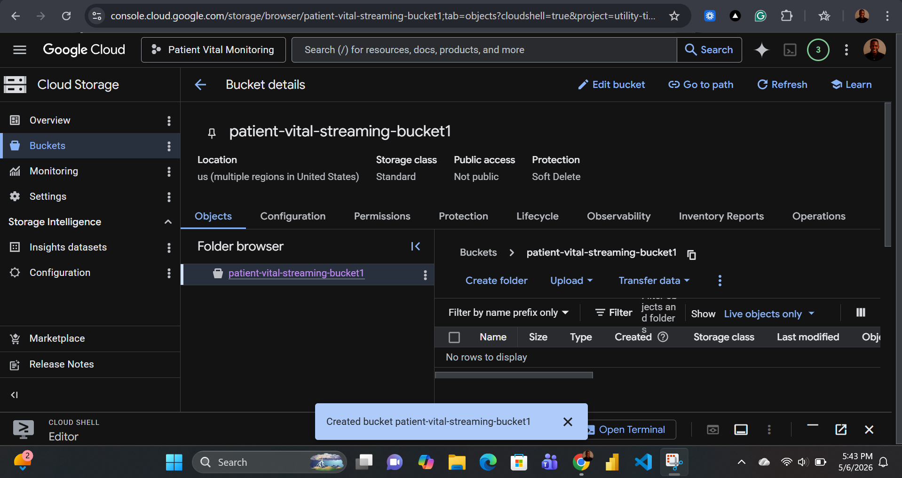
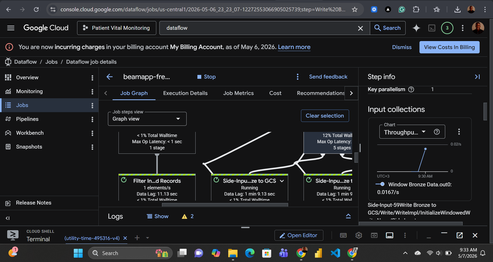

# Patient Vital Monitoring Data Engineering Project on Google Cloud Platform (GCP)

## Real-Time Healthcare Streaming Pipeline using Pub/Sub, Dataflow, BigQuery & Power BI.

---

## Project Overview

This project demonstrates how to build a complete **real-time healthcare data engineering pipeline** on Google Cloud Platform (GCP). The system simulates patient vital signs data such as:

- Heart Rate
- Blood Pressure
- Oxygen Saturation (SpO2)
- Body Temperature
- Respiratory Rate

The streaming data is processed in real time using modern cloud-native data engineering tools and visualized through interactive dashboards.

---

# Table of Contents

1. Project Goal
2. Business Problem
3. Architecture Overview
4. Technologies Used
5. Project Workflow
6. Step-by-Step Implementation
7. Why Each GCP Service Was Used
8. Data Pipeline Flow
9. Data Cleaning & Transformation
10. Real-Time Streaming
11. BigQuery Data Warehouse
12. Dashboard & Analytics
13. Screenshots
14. Key Learnings
15. Challenges Faced
16. Future Improvements
17. Conclusion
18. Author

---

# 1. Project Goal

The goal of this project is to simulate a real-world healthcare monitoring system capable of:

- Receiving patient vitals continuously
- Processing streaming healthcare data in real time
- Cleaning and transforming raw medical records
- Storing structured healthcare data in BigQuery
- Visualizing patient insights using dashboards
- Demonstrating a production-style data engineering workflow on GCP

This project teaches how modern healthcare systems process live patient information for:

- Real-time monitoring
- Medical analytics
- Emergency detection
- Hospital reporting systems
- Data-driven healthcare decisions

---

# 2. Business Problem

Healthcare systems generate massive amounts of patient monitoring data every second.

Traditional batch systems cannot efficiently handle:

- Continuous sensor streams
- Live monitoring
- Emergency alerts
- Real-time analytics

Hospitals need systems capable of:

- Ingesting streaming patient data
- Processing records instantly
- Detecting abnormal readings quickly
- Storing data reliably
- Visualizing patient trends in real time

This project solves that challenge using GCP streaming technologies.

---

# 3. Architecture Overview

The pipeline follows this real-time streaming architecture:

```text
Patient Data Simulator
        ↓
Google Cloud Pub/Sub
        ↓
Google Cloud Dataflow
        ↓
BigQuery
        ↓
Power BI Dashboard
```

---

# Architecture Diagram


---

# 4. Technologies Used

| Technology | Purpose |
|---|---|
| Python | Data simulation |
| Google Cloud Pub/Sub | Real-time message ingestion |
| Google Cloud Dataflow | Stream processing |
| Apache Beam | Data transformation framework |
| BigQuery | Data warehouse |
| Google Cloud Storage | Pipeline staging/temp storage |
| Power BI | Dashboard visualization |
| Git & GitHub | Version control |

---

# 5. Project Workflow

The project workflow consists of the following stages:

## Step 1 — Simulate Patient Data

A Python script generates synthetic patient vital records continuously.

## Step 2 — Stream Data into Pub/Sub

The generated records are streamed into a Pub/Sub topic.

## Step 3 — Process Data using Dataflow

Dataflow consumes streaming messages from Pub/Sub and applies transformations.

## Step 4 — Store Processed Data in BigQuery

Cleaned records are written into BigQuery tables for analytics.

## Step 5 — Visualize in Dashboard

Power BI connects to BigQuery and displays healthcare analytics dashboards.

---

# 6. Step-by-Step Implementation

---

# Step 1 — Creating Google Cloud Storage Bucket

Cloud Storage buckets were created for:

- Dataflow temporary files
- Staging files
- Pipeline artifacts

## Why Cloud Storage is Important

Dataflow requires temporary and staging locations during execution.

Without Cloud Storage:

- Dataflow jobs cannot run properly
- Intermediate processing files cannot be stored
- Templates and logs cannot be managed

---

## Bucket Creation Screenshot



---

## Cloud Storage Screenshot


---

# Step 2 — Creating Pub/Sub Topic

A Pub/Sub topic was created to receive streaming patient data.

## Why Pub/Sub is Important

Pub/Sub acts as the ingestion layer.

It enables:

- Real-time messaging
- Event-driven architecture
- Decoupled systems
- High scalability
- Fault tolerance

Healthcare devices continuously send events into Pub/Sub.

---

## Topic Creation Screenshot


---

# Step 3 — Creating Pub/Sub Subscription

A subscription was attached to the topic.

## Why Subscription is Important

Subscriptions allow consumers (Dataflow) to read messages from Pub/Sub.

Without subscriptions:

- Messages cannot be consumed
- Stream processing cannot begin

---

## Subscription Screenshot


---

# Step 4 — Simulating Healthcare Data

Python scripts generated synthetic patient data.

Generated fields include:

- Patient ID
- Heart Rate
- Oxygen Level
- Temperature
- Blood Pressure
- Timestamp

## Why Data Simulation is Important

Real hospital datasets are usually:

- Sensitive
- Protected by HIPAA/GDPR
- Difficult to access

Simulation enables safe development and testing.

---

## Simulated Data Screenshot


---

# Step 5 — Data Cleaning

The pipeline performs transformations and cleaning.

## Cleaning Activities

- Remove invalid records
- Convert datatypes
- Handle null values
- Normalize columns
- Format timestamps

## Why Data Cleaning is Important

Raw streaming data is often messy.

Bad healthcare data can lead to:

- Incorrect analytics
- Wrong medical decisions
- Dashboard inaccuracies

Data cleaning ensures reliability.

---

## Data Cleaning Screenshot


---

# Step 6 — Running Dataflow Pipeline

Apache Beam pipelines were deployed on Google Cloud Dataflow.

## Why Dataflow is Important

Dataflow provides:

- Real-time stream processing
- Auto scaling
- Fault tolerance
- Distributed processing
- Serverless execution

It is ideal for healthcare streaming pipelines.

---

## Dataflow Pipeline Screenshot


---

## Dataflow Working Screenshot


---

## Working Dataflow Screenshot



---

# Step 7 — BigQuery Data Warehouse

Processed records are stored in BigQuery.

## Why BigQuery is Important

BigQuery enables:

- Large-scale analytics
- SQL querying
- Real-time reporting
- Fast aggregations
- Dashboard integration

Healthcare organizations require centralized analytics storage.

---

## BigQuery Dataset Screenshot


---

## BigQuery Table Screenshot


---

# 8. Data Pipeline Flow

## Full Streaming Flow

### Data Generation
Python continuously generates patient vital records.

↓

### Message Streaming
Records are published into Pub/Sub topics.

↓

### Stream Processing
Dataflow consumes Pub/Sub messages.

↓

### Transformation
Apache Beam applies cleaning and formatting.

↓

### Storage
Processed records are inserted into BigQuery.

↓

### Visualization
Power BI displays healthcare insights.

---

# 9. Real-Time Streaming Importance

Real-time healthcare systems are critical because they allow:

- Immediate anomaly detection
- Faster patient response
- Live monitoring
- Continuous analytics
- Emergency alerting

Streaming pipelines reduce delays in medical systems.

---

# 10. Dashboard & Analytics

Power BI dashboards were created from BigQuery tables.

The dashboard visualizes:

- Average heart rate
- Oxygen saturation trends
- Temperature monitoring
- Patient distributions
- Time-series analytics

---

## Dashboard Screenshot


---

# 11. Why This Architecture Matters

This architecture demonstrates modern cloud-native engineering principles.

## Benefits

### Scalability
Can process millions of records.

### Reliability
Managed GCP services reduce operational overhead.

### Real-Time Analytics
Enables instant healthcare insights.

### Fault Tolerance
Services recover automatically from failures.

### Serverless Processing
No infrastructure management required.

---

# 12. Important Concepts Learned

This project teaches:

- Real-time data engineering
- Event-driven systems
- Stream processing
- Apache Beam pipelines
- Cloud-native architectures
- Data warehousing
- Analytics engineering
- Dashboard reporting

---

# 13. Key GCP Services Explained

| Service | Purpose | Why Important |
|---|---|---|
| Pub/Sub | Messaging system | Enables streaming ingestion |
| Dataflow | Stream processing | Processes data in real time |
| BigQuery | Analytics warehouse | Stores healthcare analytics |
| Cloud Storage | Temp/staging storage | Supports Dataflow jobs |
| Power BI| Visualization | Displays dashboards |

---

# 14. Challenges Faced

## Streaming Pipeline Setup

Configuring streaming jobs correctly requires:

- Pub/Sub configuration
- Proper IAM permissions
- Correct pipeline arguments

## Data Consistency

Ensuring clean and properly formatted records was essential.

## Real-Time Processing

Maintaining continuous streaming required debugging pipeline failures and monitoring jobs carefully.

---

# 15. Future Improvements

Possible enhancements include:

- Adding anomaly detection using ML
- Integrating wearable IoT devices
- Implementing alert systems
- Creating hospital notifications
- Adding patient risk scoring
- Deploying CI/CD pipelines
- Containerizing applications with Docker
- Using Terraform for infrastructure automation

---

# 16. Real-World Applications

This architecture can be adapted for:

- Hospital monitoring systems
- ICU monitoring
- Smart healthcare systems
- Wearable fitness tracking
- Emergency response analytics
- Telemedicine platforms

---

# 17. Conclusion

This project demonstrates how to build a modern real-time healthcare data pipeline using Google Cloud Platform.

The solution combines:

- Streaming ingestion
- Real-time processing
- Cloud-native architecture
- Analytics engineering
- Dashboard visualization

By leveraging Pub/Sub, Dataflow, BigQuery, and Power BI, healthcare data can be processed efficiently and analyzed in real time.

This project provides hands-on experience with production-grade data engineering concepts widely used in modern cloud environments.

---

# 18. Project Screenshots

| Screenshot | Description |
|---|---|
| architecture.png | System architecture |
| bucked_creation.png | Cloud Storage bucket creation |
| cloudstorage.png | Cloud Storage overview |
| topic_created.png | Pub/Sub topic creation |
| subscription_created.png | Pub/Sub subscription |
| data_simulated.png | Simulated healthcare data |
| data_cleaning.png | Data transformation |
| dataflow.png | Dataflow pipeline |
| dataflow_working.png | Active Dataflow job |
| working_dataflow.png | Streaming pipeline execution |
| bigquerry_data.png | BigQuery dataset |
| bigquerry_table.png | BigQuery table |
| dashboard.png | Analytics dashboard |

---

# Author

## Fred Kibutu

GitHub: [KibutuJr](https://github.com/KibutuJr)

LinkedIn: [Fred Kibutu](https://www.linkedin.com/in/fred-kibutu/)

Portfolio : [KibutuJR](https://kibutujr.vercel.app/)

---

# License

MIT License

---


---
